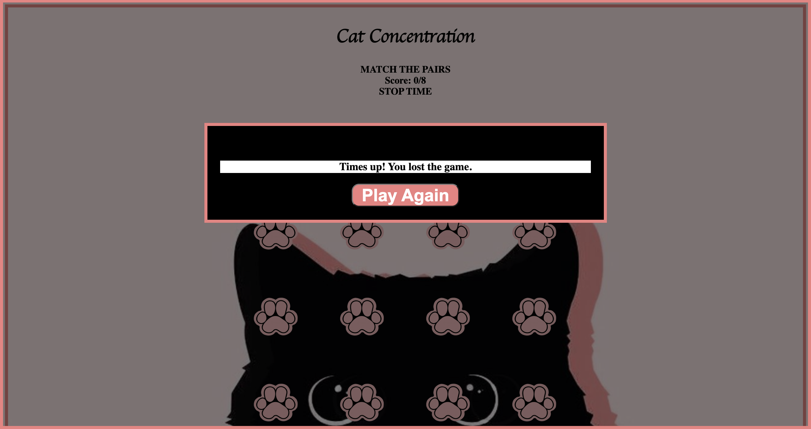

<main align="center" style="font-family: 'cursive'";>

# <strong><em> Cat Concentration </em></strong>


### [Live Demo](https://sally-kam.github.io/concentrationGame/) 

</main>

---

## Description: 
Concentration is a matching card game where all the cards are laid out face down on the screen and two cards are flipped face up for each turn. The goal is to match the pairs of cards within the time limit.

---

## Technologies used:


---

## Getting Started: 
1. Press the <kbd>Start Game</kbd> button to start the game

2. Match the pairs in 60 seconds
3. If you match the pairs before the timer runs out, you win the game!
4. Press <kbd>New Game</kbd> button to start a new game.

5. If you didn't match the pairs before the timer runs out, you lose the game!
6. Press <kbd>Play Again</kbd> button to play again.


---

## Next Steps:

* adjust CSS to make the game mobile 
* add easy, medium, and hard levels to the game
* add a flip card animation
* add a reset button during the game if the player wants to start over in the middle of the game
* add audio for winning and losing the game.


---

## Interesting Code

The checkForMatch function determines if the player chose 2 cards that are matched. 

```js
function checkForMatch() {
  //cards variable selects the img elements
  let cards = document.querySelectorAll('img');
  // selects the cards the player has chosen to compare them for a match
  const firstCard = cardsChosenId[0];
  const secondCard = cardsChosenId[1];
  // if the same card was clicked twice, it can flip back to the default card
  if (firstCard == secondCard) {
    setTimeout(() => {
      if (cards[firstCard] && cards[secondCard]) {
        cards[firstCard].src = 'imgs/pawprint1.png';
        cards[secondCard].src = 'imgs/pawprint1.png';
      }
    }, 100);
    // if 2 cards chosen are matched, it removes the click event listener to lock them in the flipped image and keeps track of the matched card pairs by pushing.
  } else if (cardsChosen[0] === cardsChosen[1]) {
    setTimeout(() => {
      if (cards[firstCard] && cards[secondCard]) {
        cards[firstCard].removeEventListener('click', flipCard);
        cards[secondCard].removeEventListener('click', flipCard);
      }
    }, 100);
    cardsWon.push(cardsChosen);
    // if the 2 cards chosen are not matched, it flips both cards back.
  } else {
    setTimeout(() => {
      if (cards[firstCard] && cards[secondCard]) {
        cards[firstCard].src = 'imgs/pawprint1.png';
        cards[secondCard].src = 'imgs/pawprint1.png';
      }
    }, 100);
  }
  //reset the arrays so the player can click two new cards.
  cardsChosen = [];
  cardsChosenId = [];
  //updates the score results
  resultDisplay.innerText = `Score: ${cardsWon.length}/8`;
  //the card pairs is equal to half of cards in the cardsArray and displays the winning pop-up modal
  if (cardsWon.length === cardsArray.length / 2) {
    timerEl.innerText = 'STOP TIME';
    winModal.style.display = 'block';
  }
}
```


