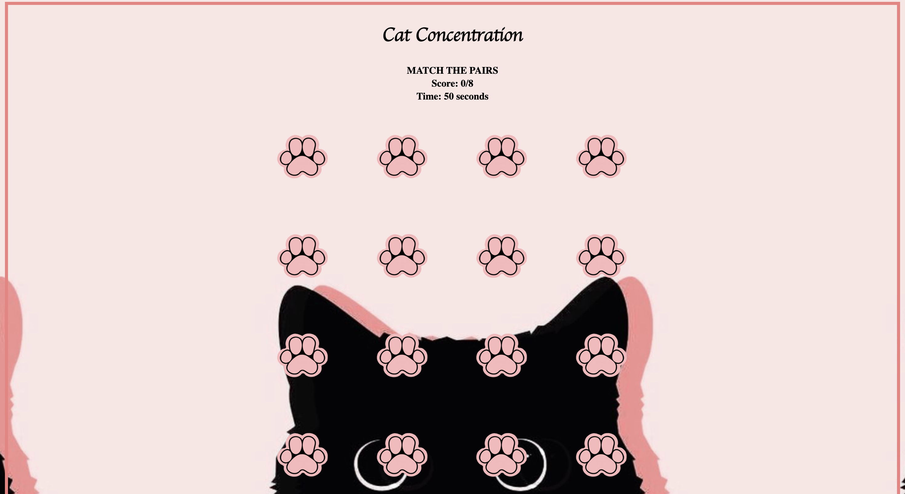

# Cat Concentration 
## Concentration is a matching card game where all the cards are laid out face down on the screen and two cards are flipped face up for each turn. The goal is to match the pairs of cards within the time limit.


**Screenshot(s):**
//insert images


**Technologies used: HTML, CSS, Javascript**


**Getting Started**
//include link to deployed game and any instructions that are important

/----- constants -----/
-define the array of cards

/----- state variables -----/
-define the matched pair of cards
-define the flipped pair of cards

/----- cached elements -----/
-define results variable
-define the init function
-define the start function
-define the timer function


/----- event listeners -----/
-add variable when cards are flipped
-add variable when start buttion is clicked
-add variable when restart button is clicked
-add variable when cards are unmatched
/----- functions -----/
-add init function
-add render function
-add timer function
-add results function
-add flipping card function
-add click function
-add shuffle function

add testing

# Cat Concentration
---
### Description: Concentration is a matching card game where all the cards are laid out face down on the screen and two cards are flipped face up for each turn. The goal is to match the pairs of cards within the time limit.
### Level 3 Heading
#### Level 4 Heading
##### Level 5 Heading
###### Level 6 Heading# Level 1 Heading
---

---
Thank you for showing up today project week is streesful.


[link to game](http://)

* First list item
* Second list item
* Third list item

1. First list item
1. Second list item
1. Third list item

1. Parent list item 1
1. Parent list item 2
 a. Child list item a
 b. Child list item b
1. Parent list item 3
    * Child item 1 
    * Child item 2

| First Name | Last Name | Age |
| :--------- | :-------: | --: |
| John       |    Doe    |  28 |
| Jane       |    Doe    |  52 |

Strikethrough text ~~like this~~ using a pair of double tildes

Highlight text ==like this== using a pair of double equality signs

```js
console.log("hello world");
```

```html
hi
```


